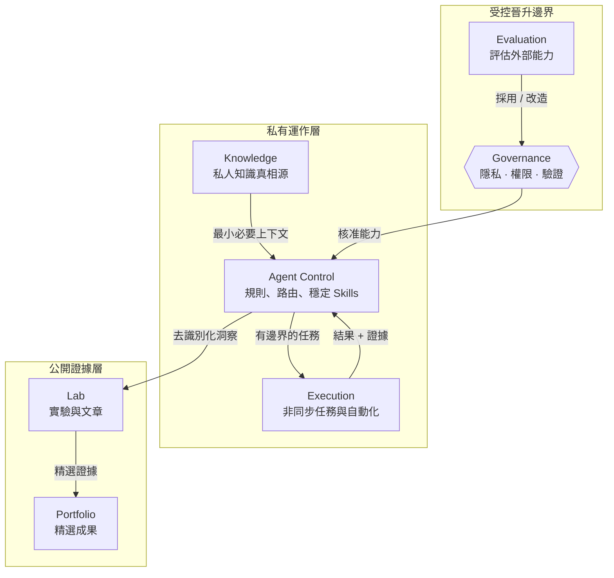

# AI Agent Architecture

一套以隱私安全為前提，用來設計多代理 AI 工作空間的參考架構與方法論。

這個 repository 關注的是**系統如何被設計與治理**，而不是公開任何人的真實 AI 記憶、帳號、裝置、私人 repository、憑證或實際運作脈絡。

> **核心原則：公開方法，不公開私人 AI 大腦。**

## 從這裡開始

建議閱讀順序：

1. [架構視覺圖](docs/architecture/visual-map.md) — 先看整體系統、邊界與控制迴路。
2. [六倉架構模式](docs/architecture/six-repository-pattern.md) — 將知識、代理控制、評估、執行、實驗與作品集責任拆開。
3. [跨倉資料流](docs/architecture/data-flow.md) — 定義哪些 artifact 可以跨倉交換，以及哪些資訊必須保持私有。
4. [Agent / Skill / Governance 模型](docs/architecture/agent-skill-governance.md) — 分離判斷、可重複程序、權限與批准機制。
5. [Agent 工作方法](docs/methodology/agent-workflow.md) — 目標 → 路由 → 執行 → 驗證 → 批准 → 交接。
6. [匿名功能交付範例](examples/feature-delivery.md) — 使用完全虛構的情境走完一次完整流程。
7. [公開／私有邊界](docs/governance/public-private-boundary.md) — 如何把私人實作經驗萃取成可公開的方法。
8. [隱私規範](PRIVACY.md) — 明確列出不可提交到公開 repository 的內容。

## 這個 repository 要說明什麼

- 如何把私人記憶與公開架構分離
- Agent、Skill、Workflow 與 Governance 如何分工
- 如何在多個 AI Agent 之間派工，而不是把所有權限交給每一個 Agent
- 如何透過明確 artifact 交換上下文，而不是直接傾倒完整記憶
- 如何建立 handoff、review gate 與 human approval 邊界
- 如何在新 Skill 或外部工具進入穩定工作流之前先做評估
- 如何分離同步互動、非同步執行、知識、實驗、發布與作品集層
- 如何把私人運作經驗轉成不含個資的公開模式與範例

## 參考架構



六個 repository 代表的是**架構角色**，不是強制要求使用固定名稱。真正重要的是責任、資訊流與權限邊界。

## 三個核心關注點

```text
Agent       = 判斷與協調
Skill       = 可重複的執行契約
Governance  = 權限、風險、驗證與批准
```

一個能力很強的 Agent，不代表它自動擁有所有操作權。Governance 必須限制 Agent 與 Skill 可以讀取、寫入、安裝、合併、發布或部署的範圍。

## Repository 結構

```text
docs/
├── architecture/
│   ├── visual-map.md
│   ├── six-repository-pattern.md
│   ├── system-overview.md
│   ├── data-flow.md
│   └── agent-skill-governance.md
├── methodology/
│   └── agent-workflow.md
└── governance/
    └── public-private-boundary.md

examples/
├── README.md
└── feature-delivery.md

templates/
└── workspace.example.yaml

PRIVACY.md
README.md
```

## 方法濃縮成一條流程

```text
Intent
  ↓
Context Contract
  ↓
Routing + Bounded Assignment
  ↓
Skill-based Execution
  ↓
Validation Evidence
  ↓
Risk / Human Approval Gate
  ↓
Reviewable Output
  ↓
Sanitized Learning
```

## 隱私規則

禁止提交：

- 個人記憶或對話紀錄
- 真實 Email、電話、姓名或帳號識別資訊
- API Key、Token、Cookie、密碼或其他 Secret
- 私有 repository 名稱或內部 URL
- 雇主、客戶或機密專案資訊
- 本機絕對路徑、hostname、IP 或裝置識別資訊
- Production integration 的真實設定

公開範例必須使用虛構名稱、泛化路徑、placeholder identifier 與不可回推真實身份的情境。

新增內容前請先閱讀 [PRIVACY.md](PRIVACY.md)。

## 目前狀態

目前已定義第一版公開參考架構，包括六倉模式、跨倉資料流、Agent / Skill / Governance 模型、隱私邊界與第一個匿名端到端範例。可執行工具應等這些契約穩定後再加入，避免方法論還未定型就綁死實作。