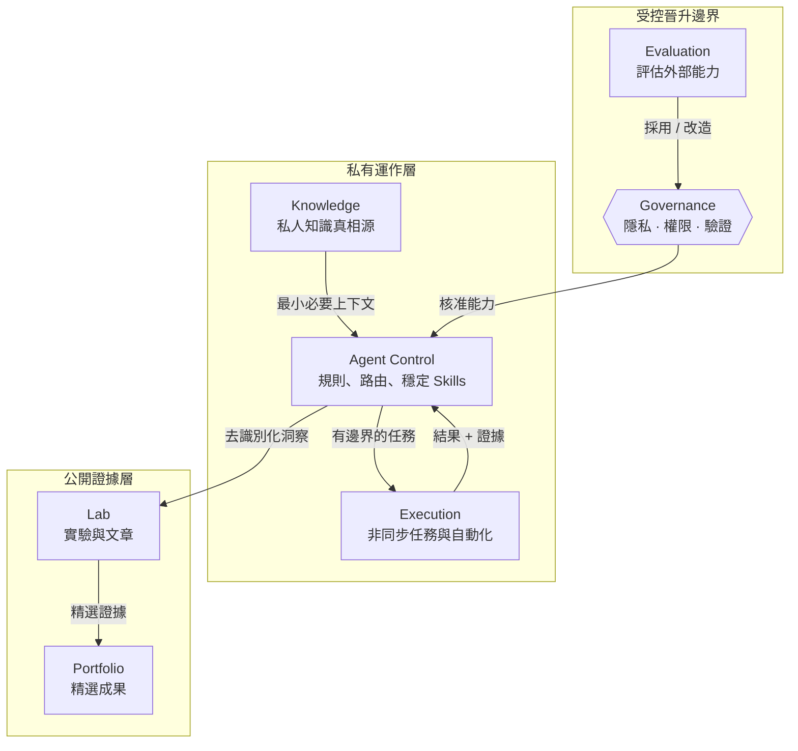

# AI Agent Architecture

一套以隱私安全為前提，用來設計多代理 AI 工作空間的參考架構、方法論，以及可公開重用的 Agent / Skill 契約。

這個 repository 關注的是**系統如何被設計與治理**，而不是公開任何人的真實 AI 記憶、帳號、裝置、私人 repository、憑證或實際運作脈絡。

> **核心原則：公開方法，不公開私人 AI 大腦。**

## 先理解架構層級

這個專案包含六倉、Agent、Skill、Governance、Workflow、Artifact 等概念，但它們**不是同一層級**。

```text
Level 0  系統邊界
         Private / Public

Level 1  Repository Architecture
         六倉＝系統級責任分區

Level 2  Operating Model
         Agent / Skill / Tool＝倉內如何判斷與執行

         Governance＝橫跨所有層級的控制面

Level 3  Workflow
         Intent → Context → Routing → Execution → Validation → Approval → Handoff

Level 4  Artifact / Contract
         不同角色與 Repository 之間交換資訊的介面
```

最重要的區分是：

```text
Repository  = 責任放在哪裡
Agent       = 誰負責判斷與協調
Skill       = 怎麼按照穩定程序執行
Tool        = 實際對外部系統產生操作
Workflow    = 工作按照什麼順序流動
Artifact    = 不同角色之間交換什麼
Governance  = 以上所有行為哪些被允許
```

完整說明見 [架構層級模型](docs/architecture/layer-model.md)。

## 從這裡開始

建議閱讀順序：

1. [架構層級模型](docs/architecture/layer-model.md) — 先理解六倉、Agent、Skill、Governance、Workflow、Artifact 彼此的上下層關係。
2. [架構視覺圖](docs/architecture/visual-map.md) — 看整體系統、公開／私有邊界與控制迴路。
3. [六倉架構模式](docs/architecture/six-repository-pattern.md) — 將知識、代理控制、評估、執行、實驗與作品集責任拆開。
4. [跨倉資料流](docs/architecture/data-flow.md) — 定義哪些 artifact 可以跨倉交換，以及哪些資訊必須保持私有。
5. [Agent / Skill / Governance 模型](docs/architecture/agent-skill-governance.md) — 分離判斷、可重複程序、工具權限與批准機制。
6. [公開 Agent 套件](agents/README.md) — 可直接採用或改造的 Coordinator / Implementer / Reviewer / Evaluator 角色契約。
7. [公開 Skill 套件](skills/README.md) — 可重用的 Task Contract、Bounded Implementation、Evidence Review、Privacy Sanitizer、Handoff 與 Capability Evaluation。
8. [Agent 工作方法](docs/methodology/agent-workflow.md) — 目標 → 路由 → 執行 → 驗證 → 批准 → 交接。
9. [匿名功能交付範例](examples/feature-delivery.md) — 使用完全虛構的情境走完一次完整流程。
10. [公開／私有邊界](docs/governance/public-private-boundary.md) — 如何把私人實作經驗萃取成可公開的方法。
11. [隱私規範](PRIVACY.md) — 明確列出不可提交到公開 repository 的內容。

## 可直接公開使用的 Agent / Skill

### Agents

```text
Coordinator  → 目標、Scope、Routing、Assignment、Approval Gate
Implementer  → 在受限 Scope 內執行，產出 Validation Evidence
Reviewer     → Read-only 獨立審查 Acceptance Criteria 與 Evidence
Evaluator    → 評估外部 Skill / Tool / MCP 是否可 Adopt / Adapt / Reject
```

這些角色定義放在 [`agents/`](agents/README.md)，不綁定 Claude、Codex、Gemini 或其他特定模型。

### Skills

```text
task-contract           → 把模糊需求轉成可執行契約
bounded-implementation  → 做最小、安全、可逆的變更
evidence-review         → 依證據與驗收條件做審查
privacy-sanitizer       → 把私人經驗去識別化成公開方法
handoff                 → 產出下一個角色可直接接手的狀態
capability-evaluation   → 評估新 AI 能力的採用與晉升條件
```

每個 Skill 都定義 `Purpose / Inputs / Outputs / Preconditions / Permissions / Procedure / Validation / Failure Conditions / Completion Criteria`，可直接轉成不同 Agent Runtime 的 Skill 格式。

## 這個 repository 要說明什麼

- 如何把私人記憶與公開架構分離
- 六倉的責任層級與彼此邊界
- Agent、Skill、Tool、Workflow 與 Governance 如何分工
- 如何在多個 AI Agent 之間派工，而不是把所有權限交給每一個 Agent
- 如何透過明確 Artifact Contract 交換上下文，而不是直接傾倒完整記憶
- 如何建立 Handoff、Review Gate 與 Human Approval 邊界
- 如何在新 Skill 或外部工具進入穩定工作流之前先做評估
- 如何分離同步互動、非同步執行、知識、實驗、發布與作品集層
- 如何把私人運作經驗轉成不含個資的公開模式與範例

## 參考架構



六個 repository 代表的是**Level 1 的架構角色**，不是六個 Workflow Step，也不是六個 Agent。真正重要的是責任、資訊流與權限邊界。

## 倉內運作模型

當任務進入 Agent Control / Execution 之後，才進入 Level 2：

```text
Agent
  ↓ 選擇 / 協調
Skill
  ↓ 使用
Tool
  ↓
Files / APIs / Git / Browser / Test Runner
```

Governance 不在這條線的最後，而是從旁限制整條鏈：

```text
                 Governance
        ┌────────────┼────────────┐
        ↓            ↓            ↓
      Agent        Skill         Tool
```

因此，一個能力很強的 Agent，不代表它自動擁有所有操作權。

## Repository 結構

```text
agents/
├── README.md
├── coordinator.md
├── implementer.md
├── reviewer.md
└── evaluator.md

skills/
├── README.md
├── task-contract/SKILL.md
├── bounded-implementation/SKILL.md
├── evidence-review/SKILL.md
├── privacy-sanitizer/SKILL.md
├── handoff/SKILL.md
└── capability-evaluation/SKILL.md

docs/
├── architecture/
│   ├── layer-model.md
│   ├── visual-map.md
│   ├── six-repository-pattern.md
│   ├── system-overview.md
│   ├── data-flow.md
│   └── agent-skill-governance.md
├── methodology/
│   └── agent-workflow.md
└── governance/
    └── public-private-boundary.md

examples/
├── README.md
└── feature-delivery.md

templates/
└── workspace.example.yaml

PRIVACY.md
README.md
```

## 方法濃縮成一條流程

```text
Intent
  ↓
Context Contract
  ↓
Routing + Bounded Assignment
  ↓
Skill-based Execution
  ↓
Validation Evidence
  ↓
Risk / Human Approval Gate
  ↓
Reviewable Output
  ↓
Sanitized Learning
```

這條流程描述的是 **Level 3 Workflow**；其中的 `Context Contract`、`Assignment Brief`、`Execution Evidence` 等則屬於 **Level 4 Artifact Contract**。

## 隱私規則

禁止提交：

- 個人記憶或對話紀錄
- 真實 Email、電話、姓名或帳號識別資訊
- API Key、Token、Cookie、密碼或其他 Secret
- 私有 repository 名稱或內部 URL
- 雇主、客戶或機密專案資訊
- 本機絕對路徑、hostname、IP 或裝置識別資訊
- Production integration 的真實設定

公開範例必須使用虛構名稱、泛化路徑、placeholder identifier 與不可回推真實身份的情境。

新增內容前請先閱讀 [PRIVACY.md](PRIVACY.md)。

## 目前狀態

目前已定義第一版公開參考架構與可重用契約，包括：

- 架構層級模型
- 六倉責任模式
- 公開／私有邊界
- 跨倉資料流
- Agent / Skill / Tool / Governance 模型
- Workflow 與 Artifact Contract
- 4 個公開 Agent 角色
- 6 個公開 Skill Contract
- 第一個匿名端到端範例

目前公開內容仍以**方法與契約**為主，不包含真實 Production Runtime、私人系統設定或 Credential。