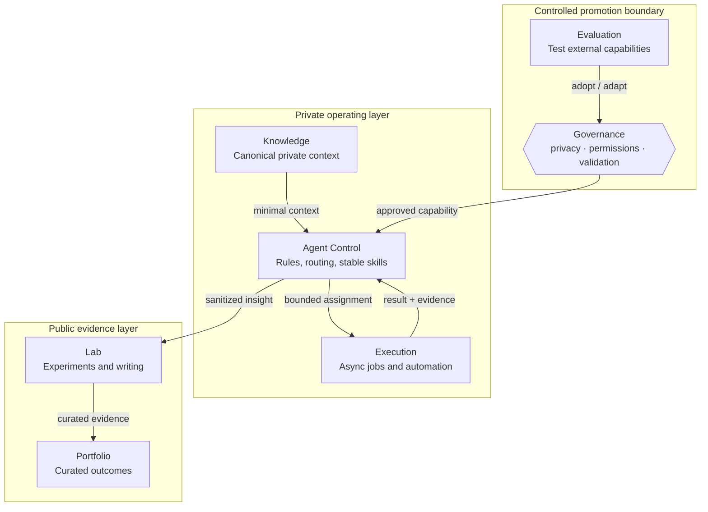

# AI Agent Architecture

A privacy-safe reference architecture and methodology for designing multi-agent AI workspaces.

This repository focuses on **how the system is designed** rather than exposing any person's actual AI memory, accounts, machines, repositories, credentials, or private operating context.

> **Core principle:** Publish the method, not the private brain.

## Start here

Recommended reading order:

1. [Architecture Visual Map](docs/architecture/visual-map.md) — see the system, boundaries, and control loop first.
2. [Six-Repository Pattern](docs/architecture/six-repository-pattern.md) — separate knowledge, agent control, evaluation, execution, lab, and portfolio responsibilities.
3. [Cross-Repository Data Flow](docs/architecture/data-flow.md) — define what artifacts move between roles and what must stay private.
4. [Agent / Skill / Governance Model](docs/architecture/agent-skill-governance.md) — separate judgment, repeatable procedures, permissions, and approval.
5. [Agent Workflow Methodology](docs/methodology/agent-workflow.md) — goal → routing → execution → validation → approval → handoff.
6. [Synthetic Feature Delivery Example](examples/feature-delivery.md) — walk through the full method without using real personal or project data.
7. [Public / Private Boundary](docs/governance/public-private-boundary.md) — safely distill private work into public methodology.
8. [Privacy Policy](PRIVACY.md) — content that must never be committed.

## What this repository explains

- How to separate private memory from public architecture
- How agents, skills, workflows, and governance fit together
- How to route work across multiple AI agents without giving every agent every permission
- How to exchange context through explicit artifacts instead of full memory dumps
- How to use explicit handoffs, review gates, and human approval boundaries
- How to evaluate new skills and tools before promoting them into a stable workflow
- How to separate synchronous interaction, asynchronous execution, knowledge, experimentation, publishing, and portfolio surfaces
- How to turn private operating experience into privacy-safe public patterns and examples

## Reference architecture



The six repositories are architectural **roles**, not mandatory names. The important part is responsibility, information flow, and permission boundaries.

## Three concerns

```text
Agents       = judgment and coordination
Skills       = repeatable execution contracts
Governance   = permissions, risk, validation, approval
```

A capable agent is not automatically an authorized agent. Governance constrains what agents and skills may read, write, install, merge, publish, or deploy.

## Repository structure

```text
docs/
├── architecture/
│   ├── visual-map.md
│   ├── six-repository-pattern.md
│   ├── system-overview.md
│   ├── data-flow.md
│   └── agent-skill-governance.md
├── methodology/
│   └── agent-workflow.md
└── governance/
    └── public-private-boundary.md

examples/
├── README.md
└── feature-delivery.md

templates/
└── workspace.example.yaml

PRIVACY.md
README.md
```

## Method in one flow

```text
Intent
  ↓
Context contract
  ↓
Routing + bounded assignment
  ↓
Skill-based execution
  ↓
Validation evidence
  ↓
Risk / human approval gate
  ↓
Reviewable output
  ↓
Sanitized learning
```

## Privacy rule

Never commit:

- personal memory or conversation history
- real email addresses, phone numbers, names, or account identifiers
- API keys, tokens, cookies, passwords, or secrets
- private repository names or internal URLs
- employer, client, or confidential project information
- local absolute paths, hostnames, IP addresses, or device identifiers
- production integration configuration

Public examples must use synthetic names, generic paths, placeholder identifiers, and non-identifying scenarios.

See [PRIVACY.md](PRIVACY.md) before adding new content.

## Status

This project is being developed as a public reference architecture. The architecture, data-flow, governance model, privacy boundary, and first synthetic end-to-end example are now defined. Executable reference tooling should only be added after these contracts are stable.
