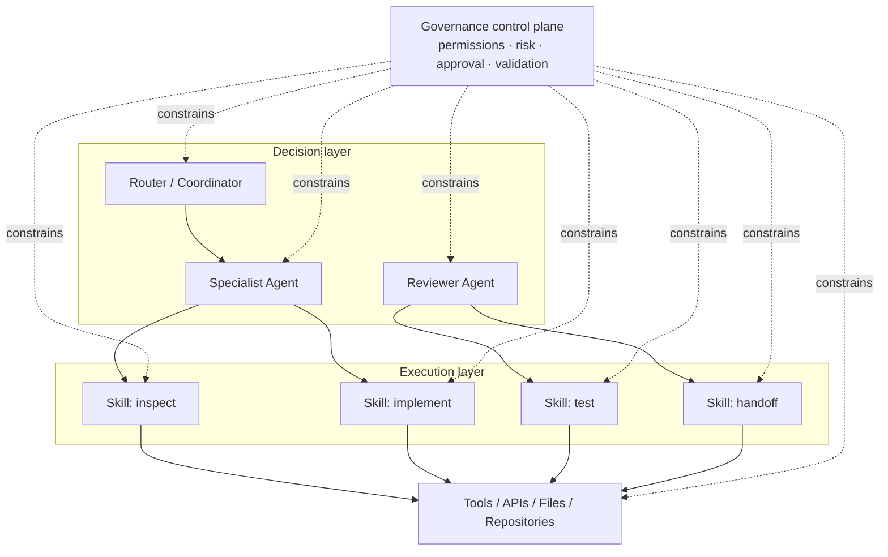
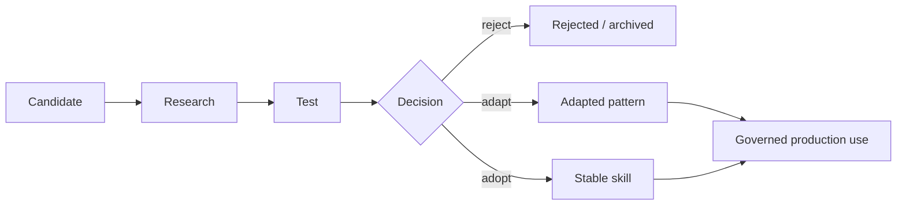

# Agent / Skill / Governance Model

A multi-agent system becomes easier to reason about when three concerns are separated:

- **Agents decide and coordinate.**
- **Skills define repeatable execution procedures.**
- **Governance constrains what both are allowed to do.**

Governance is not a fourth execution layer. It is a cross-cutting control plane that limits routing, permissions, mutation, validation, and approval.

## Model



## Responsibility boundaries

### Agent

An agent owns judgment within a bounded responsibility.

Typical responsibilities:

- interpret the current goal
- choose a workflow or skill
- split work into assignments
- decide when evidence is sufficient
- escalate ambiguity or risk

An agent should **not** duplicate detailed procedural rules already owned by a skill.

### Skill

A skill is a reusable execution contract.

A useful skill definition includes:

```yaml
name: example-review
inputs:
  - target
  - acceptance_criteria
outputs:
  - findings
  - evidence
preconditions:
  - target_is_readable
permissions:
  - read
validation:
  - evidence_required
```

The skill should define the repeatable procedure, expected artifacts, failure conditions, and tool boundary.

### Governance

Governance determines whether an otherwise valid action is permitted.

Examples:

- protected branches cannot be written directly
- secrets cannot be copied into prompts or public artifacts
- external skills must be evaluated before promotion
- production deployment requires human approval
- destructive actions require explicit authorization
- validation evidence is required before completion

## Decision precedence

When rules conflict, use an explicit precedence model:

```text
Security / privacy boundary
        ↓
Governance policy
        ↓
Task-specific constraints
        ↓
Skill contract
        ↓
Agent discretion
        ↓
Model preference
```

Higher layers narrow lower layers. An agent cannot override a security boundary because it believes another path is more efficient.

## Least-context and least-privilege assignment

Each subtask should receive:

1. only the context needed to make the decision,
2. only the tools needed to perform the procedure,
3. only the write scope needed for the output,
4. explicit completion criteria.

Example:

```yaml
assignment:
  objective: "Review example component accessibility"
  context:
    - "component source"
    - "acceptance criteria"
  tools:
    - "read files"
    - "run accessibility tests"
  writes:
    - "none"
  complete_when:
    - "findings include evidence and severity"
```

A later implementation assignment may receive write permission, but the reviewer does not need it.

## Promotion lifecycle

Capabilities should move through states instead of appearing directly in the stable agent environment.



This makes the system explainable: stable behavior exists because it passed an explicit evaluation and promotion decision.
