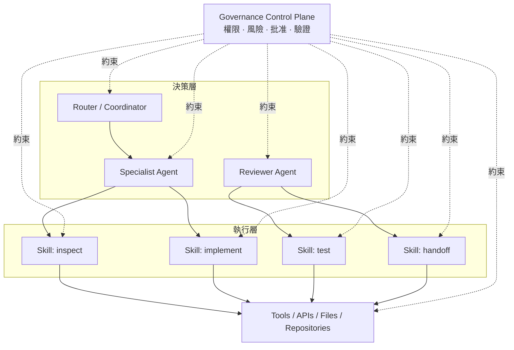

# Agent / Skill / Governance 模型

多代理系統要容易理解與維護，應該把三種責任分開：

- **Agent 負責判斷與協調。**
- **Skill 負責可重複的執行程序。**
- **Governance 限制 Agent 與 Skill 被允許做什麼。**

Governance 不是第四個執行層，而是一個橫跨整個系統的控制平面（control plane），負責限制 Routing、Permission、Mutation、Validation 與 Approval。

## 模型



## 責任邊界

### Agent

Agent 在明確責任範圍內負責判斷。

常見責任包括：

- 理解目前目標
- 選擇 Workflow 或 Skill
- 把工作拆成 Assignment
- 判斷 Evidence 是否足夠
- 遇到風險或不確定性時升級處理

Agent **不應重複 Skill 已經定義好的詳細程序規則**，否則規則會散落在多處，難以維護與審查。

### Skill

Skill 是可重用的執行契約（execution contract）。

一個可審查的 Skill 至少應定義：

```yaml
name: example-review
inputs:
  - target
  - acceptance_criteria
outputs:
  - findings
  - evidence
preconditions:
  - target_is_readable
permissions:
  - read
validation:
  - evidence_required
```

Skill 應負責定義：

- 可重複程序
- 輸入與輸出
- 預期 Artifact
- Failure Condition
- Tool Boundary
- Validation Requirement

### Governance

Governance 判斷「即使技術上做得到，這個操作是否被允許」。

例如：

- Protected Branch 不得直接寫入
- Secret 不得複製到 Prompt 或 Public Artifact
- 外部 Skill 必須經過評估才能晉升
- Production Deployment 必須人工批准
- Destructive Action 必須取得明確授權
- 任務完成前必須有 Validation Evidence

## 規則優先序

當規則互相衝突時，應使用明確優先序：

```text
Security / Privacy Boundary
        ↓
Governance Policy
        ↓
Task-specific Constraints
        ↓
Skill Contract
        ↓
Agent Discretion
        ↓
Model Preference
```

上層規則限制下層規則。Agent 不能因為認為某個方法「比較快」就覆寫 Security Boundary。

## Least Context + Least Privilege Assignment

每一個 Subtask 應只取得：

1. 做判斷需要的上下文；
2. 執行程序需要的工具；
3. 產生輸出需要的最小 Write Scope；
4. 明確完成條件。

例如：

```yaml
assignment:
  objective: "檢查範例元件的 Accessibility"
  context:
    - "component source"
    - "acceptance criteria"
  tools:
    - "read files"
    - "run accessibility tests"
  writes:
    - "none"
  complete_when:
    - "findings 包含 evidence 與 severity"
```

後續 Implementation Assignment 可以取得必要寫入權，但 Reviewer 本身通常不需要。

## 能力晉升生命週期

新的能力不應直接出現在 stable agent environment，而應經過明確狀態：


這讓系統具有可解釋性：Stable Behavior 之所以存在，是因為它通過了明確的評估、風險判斷與晉升決策。