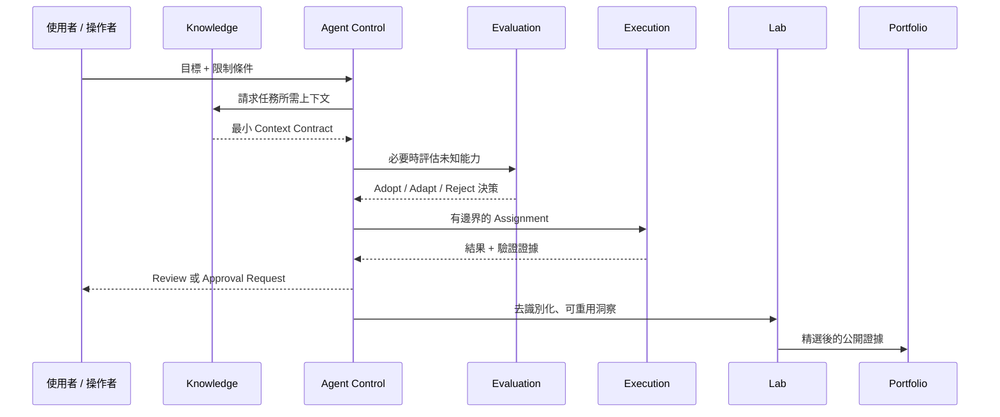
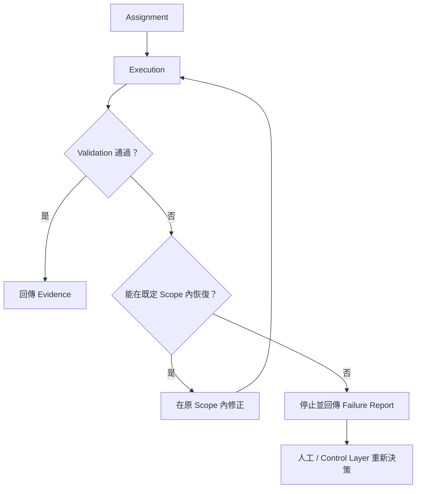

# 跨倉資料流（Cross-Repository Data Flow）

這份文件定義資訊與工作如何在不同架構角色之間移動，同時避免每一個 repository 最後都變成共享資料垃圾場。

## 資料流模型



## Artifact Contract

不同 repository 之間應交換**小而明確的 artifact**，而不是偷偷依賴彼此的內部目錄或完整資料結構。

| Artifact | 產生者 | 使用者 | 應包含 | 不應包含 |
|---|---|---|---|---|
| Context Contract | Knowledge | Agent Control | 任務相關事實、限制、已確定決策 | 完整 memory dump、無關私人上下文 |
| Capability Decision | Evaluation | Agent Control | 來源、適配度、風險、決策、安裝邊界 | 未審查第三方 Secret、私人 runtime state |
| Assignment Brief | Agent Control | Execution | 目標、Scope、允許工具、完成條件 | 無限制 Credential、模糊寫入權限 |
| Execution Evidence | Execution | Agent Control | 結果、測試、Diff 摘要、失敗、Rollback 說明 | 隱藏修改、未揭露副作用 |
| Public Insight | Agent Control / Lab | Lab | 泛化經驗、方法、Pattern | 可識別真實專案細節 |
| Portfolio Evidence | Lab | Portfolio | 精選問題、決策、成果、反思 | 機密實作細節 |

## 寫入方向規則

一個安全的預設原則是：**跨 repository 的 write 應比 read 少。**

```text
Knowledge       -> Agent Control     : 透過 Context Contract 讀取必要上下文
Evaluation      -> Agent Control     : 只晉升已核准的 Capability Decision
Agent Control   -> Execution         : 建立有邊界的 Assignment
Execution       -> Target Repository : 預設寫 branch / draft / proposal
Lab             -> Portfolio         : 輸出精選公開敘事
```

避免讓每個 Agent 都可以直接編輯所有 repository。這會讓治理邊界失效，也會讓變更來源（provenance）難以追查。

## 最小上下文原則（Minimal Context Principle）

Agent 需要上下文時，只傳遞會實際影響任務判斷的資訊。

不建議：

```text
「載入完整私人記憶與所有專案筆記。」
```

較好的做法：

```yaml
context:
  goal: "改善範例 Dashboard 的 Empty State"
  constraints:
    - "不得修改 Authentication"
    - "維持既有 Component API"
  decisions:
    - "沿用目前 Design System"
  references:
    - "public/example-screen.md"
```

## 失敗與重試路徑



Retry 不應默默擴大 Permission、Scope、成本或 Mutation Rights。

**任務失敗代表需要新的決策，不代表 Agent 自動取得無限制探索權。**