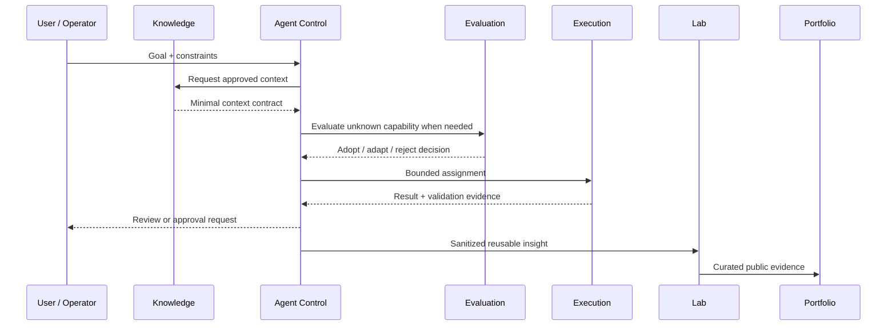
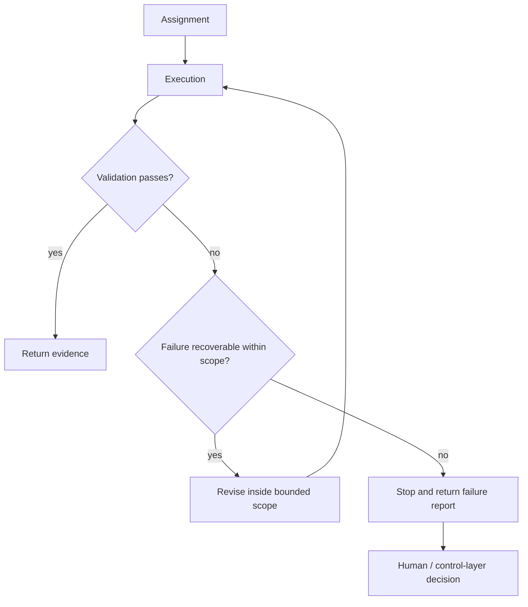

# Cross-Repository Data Flow

This document defines how information and work should move between architectural roles without turning every repository into a shared dumping ground.

## Flow model



## Artifact contracts

Repositories should exchange **small explicit artifacts** instead of silently depending on each other's internal structure.

| Artifact | Producer | Consumer | Contains | Must not contain |
|---|---|---|---|---|
| Context contract | Knowledge | Agent Control | task-relevant facts, constraints, current decisions | full memory dumps, unrelated personal context |
| Capability decision | Evaluation | Agent Control | source, fit, risks, decision, installation boundary | unreviewed third-party secrets or private runtime state |
| Assignment brief | Agent Control | Execution | objective, scope, allowed tools, completion criteria | unlimited credentials or ambiguous write permission |
| Execution evidence | Execution | Agent Control | result, tests, diff summary, failures, rollback note | hidden mutation or undocumented side effects |
| Public insight | Agent Control / Lab | Lab | generalized lesson, method, pattern | identifying project details |
| Portfolio evidence | Lab | Portfolio | curated problem, decision, outcome, reflection | confidential implementation details |

## Write-direction rules

A useful default is to make cross-repository writes rarer than reads.

```text
Knowledge       -> Agent Control     : read through a context contract
Evaluation      -> Agent Control     : promote only approved capability decisions
Agent Control   -> Execution         : create bounded work assignments
Execution       -> target repository : branch / draft / proposal by default
Lab             -> Portfolio         : curated public narrative
```

Avoid designs where every agent can directly edit every repository. That collapses governance boundaries and makes provenance difficult to audit.

## Minimal context principle

When an agent needs context, send only what materially changes the task.

Bad:

```text
"Load the entire personal memory store and all project notes."
```

Better:

```yaml
context:
  goal: "Improve the empty state of an example dashboard"
  constraints:
    - "Do not change authentication"
    - "Keep existing component API"
  decisions:
    - "Use the current design system"
  references:
    - "public/example-screen.md"
```

## Failure and retry path



Retries should not silently expand permissions, scope, cost, or mutation rights. A failed task is evidence for a new decision, not permission for unrestricted exploration.
