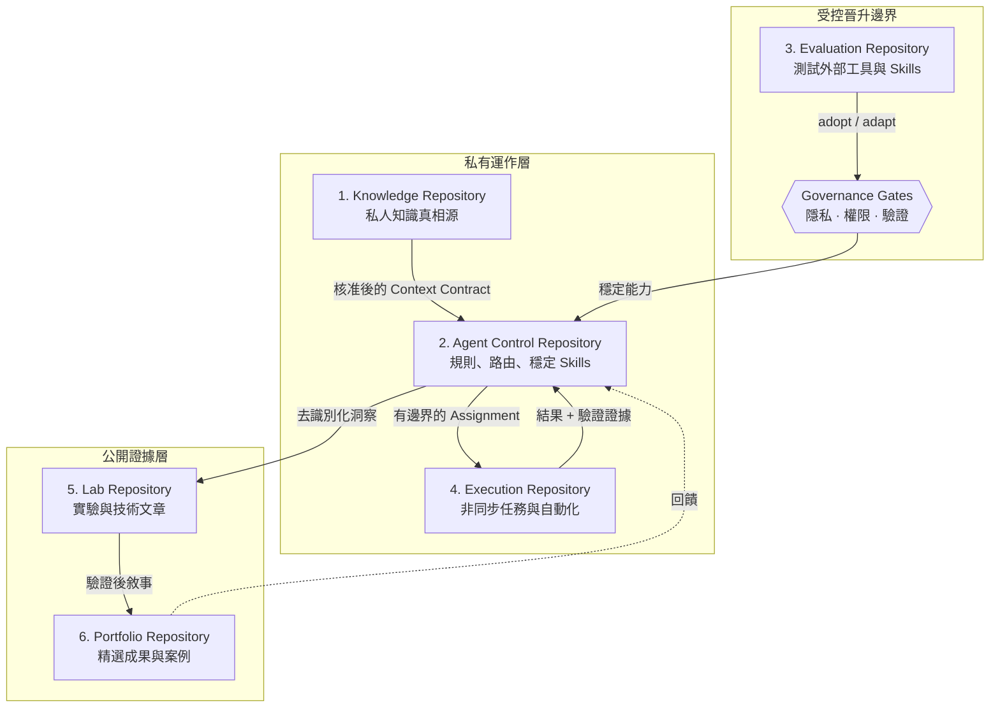
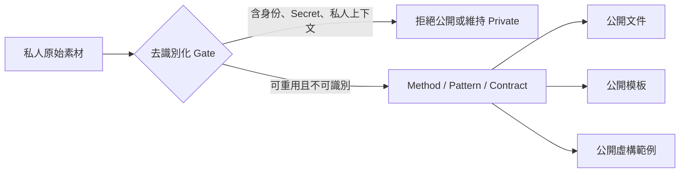
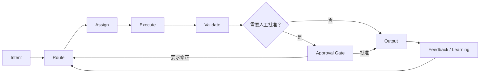

# 架構視覺圖（Architecture Visual Map）

這份文件只呈現可公開的參考架構，不包含任何真實帳號、repository、workspace、裝置或私人記憶。

## 六倉架構

六個 repository 是**架構角色**，不是強制的產品名稱。實際系統可以真的拆成六個 repository，也可以在安全邊界一致時合併；若風險與部署需求更複雜，也可能拆得更多。

## 公開／私有邊界

公開專案應該發布的是**可重用的決策與系統設計**，不是操作者真實 AI 大腦的快照。

## 控制迴路

這個迴路刻意把**判斷、執行與批准**分開。Agent 能做到某件事，不代表它自然擁有執行該操作的權限。

## 健康架構應具備的特性

1. **Canonical Truth 明確。** 記憶與政策都有清楚的真相源。
2. **Permissions 狹窄。** Agent 只取得任務真正需要的工具與寫入範圍。
3. **能力晉升有程序。** 實驗中的 Skill 不會自動變成 stable behavior。
4. **預設可回復。** 優先使用 branch、draft、proposal、preview，而不是不可逆直接寫入。
5. **公開 Artifact 已去識別化。** 範例使用 synthetic data，無法反推出私人運作上下文。