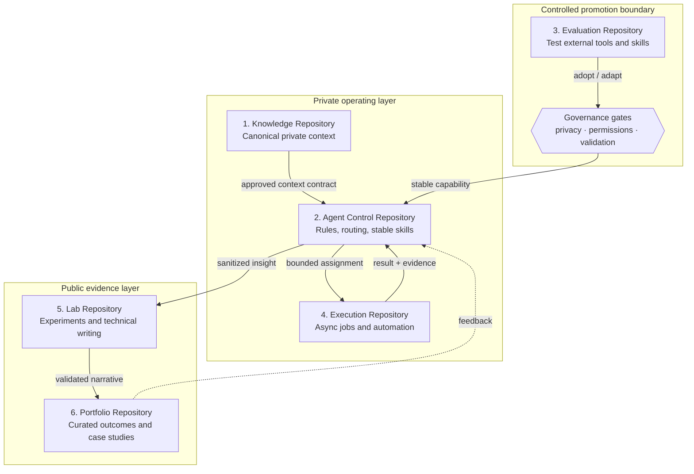
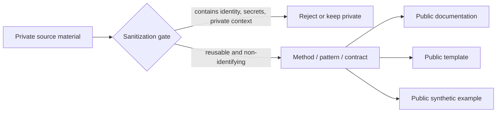
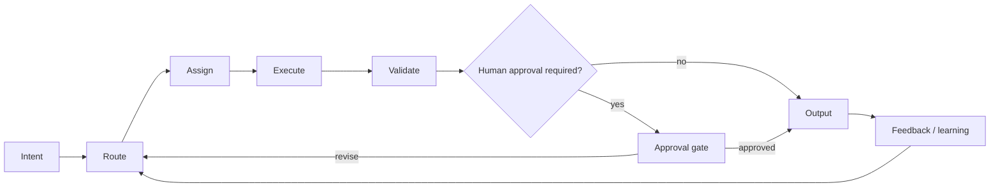

# Architecture Visual Map

This document visualizes the reference architecture without exposing any real account, repository, workspace, machine, or private memory.

## Six-repository pattern

The six repositories are **roles**, not mandatory product names. A team may implement them as six repositories, fewer repositories with strict directories, or more repositories when security boundaries require it.

## Public / private boundary

The public project should publish **reusable decisions and system design**, not snapshots of the operator's actual brain.

## Control loop

This loop separates **decision-making**, **execution**, and **approval** so that an agent is not implicitly authorized to do everything simply because it can perform the task.

## Design properties

A healthy implementation should make these properties visible:

1. **Canonical truth is explicit.** Memory and policy each have a defined source of truth.
2. **Permissions are narrow.** Agents receive only the tools and write scope needed for the assignment.
3. **Promotion is deliberate.** Experimental skills do not become stable behavior automatically.
4. **Execution is reversible by default.** Changes prefer branches, drafts, proposals, or previews over direct irreversible writes.
5. **Public artifacts are sanitized.** Examples are synthetic and cannot be used to reconstruct private operating context.
